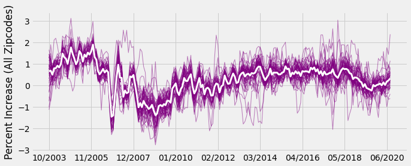
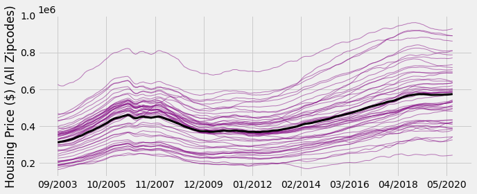
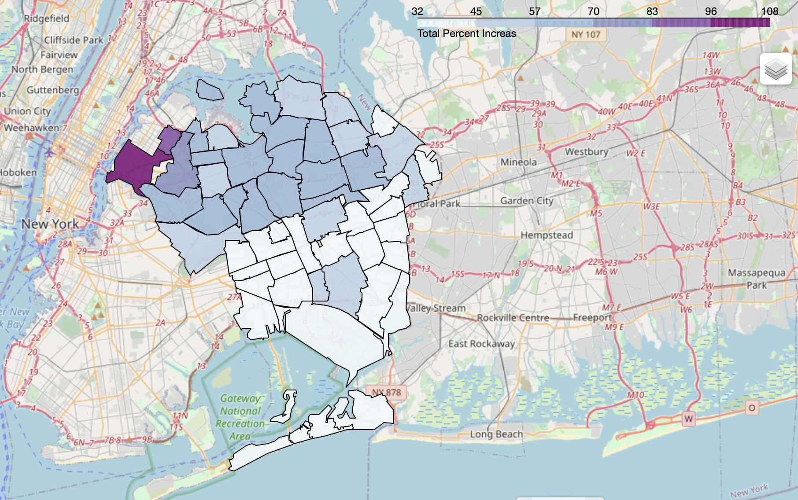
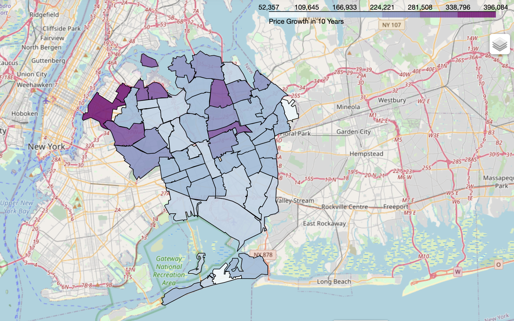
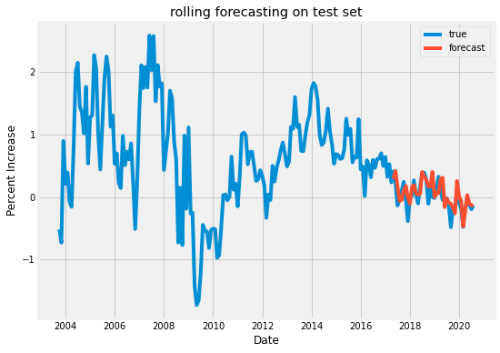
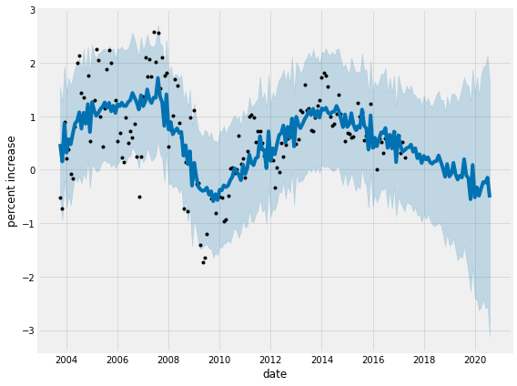

# Queens Real-Estate Prediction
The main goal of this project is to identify areas in Queens with the highest real-estate investment potentials using time series forecasting.

## Structure
- `001.Data_Cleaning.ipynb` code to clean and subset data. Generate percent increase values
- `010.Exploratory_Data_Analysis.ipynb` code for basic EDAs
- `020.Model_Evaluation.ipynb` code to evaluate various models (SARIMA, Facebook Prophet, LSTM)
- `030.Forecasting.ipynb` steps to review the forecasts from the chosen model (SARIMA)
- `SCRIPT` a folder containing all scripts with functions used in notebooks
- `PNG` a folder containing all images used on this REAME

## Data
Data was sourced from [Zillow](https://www.zillow.com/research/data/). Our data contains location information along with the Zillow Home Value Index (ZHVI, $) for time series as old as 1996. (According to Zillow, ZHVI is "A smoothed, seasonally adjusted measure of the typical home value (35th - 65th percentile range) and market changes across a given region and housing type.") Generally, the ZHVI is referred to as 'housing price' or 'average housing price' throughout this repo.

I capped the time periods to be since September 2003 because that's when all zipcodes in Queens started to provide data. Our final dataset had 203 monthly home values for each zipcode in Queens (September 2003 ~ August 2020). The last 40 months were used as a test set.

In order to compared the the growth trend across areas with different housing values, I used the percent increase of housing price at each time point instead of the actual housing price. 

Out of 54 zipcodes in Queens, I selected 4 zipcodes that deviates the most from the overall average, and 1 zipcode that is closest to the overall average to represent the majority. The select zip-codes are '11101', '11693', '11692', '11694', '11103'. 

## EDA

We can see that the housing prices in Queens are generally following similar upward trend with a very few exceptions.  
Average percent increase is about 0.3%, average ranging from -1.85% to 2.09% depending on the zipcodes. Overall the minimum value is -2.76% and the maximum value is 3.12%.

This plot shows the average price increase (%) across all Queens. We can see that there was a price bubble early 2000s, then the prices started to drop during 2007-2008 recession. Since then it's been steadily growing at around 0.5% each month, until the recent COVID-19 outbreaks. 

This map shows overall the areas closer to Manhattan (e.g. LIC) have shown the higher total percent increase.

The fixed price growth in zipcodes bordering other boroughs reflect the recent developments in these areas.

## Model Evaluation
Our data overall showed a strong yearly seasonality. Some zipcodes had non-stationary data. All zipcodes showed tailing off ACF and PACF, so I decided to use SARIMA. Additionall, I looked at the Facebook Prophet and the stacked Long Short Term Memory (LSTM) deep learning neural network. For the baseline model, I used the historic average and the persistence algorithm, which predicts the last observed value to be the following value. 

Here are some example predictions from these models (for 11101, LIC)...
#### SARIMA

#### Facebook Prophet

#### LSTM

| zipcode | historic avg | persistence | SARIMA | FB_Prophet | LSTM | 
| --- | --- | --- | --- | --- | --- |
| 11101 | 0.552 | 0.209 | 0.170 | 0.242 | 0.280 | 
| 11693 | 1.116 | 0.801 | 0.589 | 1.550 | 0.676 |
| 11692 | 1.006 | 0.853 | 0.538 | 2.227 | 0.785 |
| 11694 | 0.491 | 0.228 | 0.201 | 1.602 | 0.231 |
| 11103 | 0.316 | 0.315 | 0.222 | 0.791 | 0.303 |
|**TOTAL** | 3.479 | 2.406 | **1.720** | 6.412 | 2.221 | 

SARIMA model had the least amount of RMSE, which was an improvement from the baseline model. (Average percent increase per month per zipcode is about 0.3%)

## Forecasting
Finally, I used the SARIMA model to forecast the percent increase of housing prices in these five zipcodes.

Our model is forecasting that the price for 11693 (Rockaway Beach) will likely to continue to stay increasing even though the rate of price increase might not stay as high as it currently is. On the other hand, the prices for 11103 (Astoria) and 11101 (LIC) are at a bit of plateau right now, but will start to increase going forward. Given how Astoria had the trend closest to the overall Queens, these two neighborhoods will likely to follow similar growth pattern as the overall Queens. On the other hand, the forecast shows that prices for areas right around the Rockaway Beach (11694 and 11692) but not the central rockaway beach will likely to drop for a while.

We can see that popular areas with already high housing price like LIC and Astoria are likely continue to go up at a similar rate so worth investing into if the budget is high. On the other hand, the rockaway beach area is a growing neighborhood with lower average housing price that will likely to do well in the future. But other rockaway areas that are not around the central rockaway beach is forecasted to decrease.

